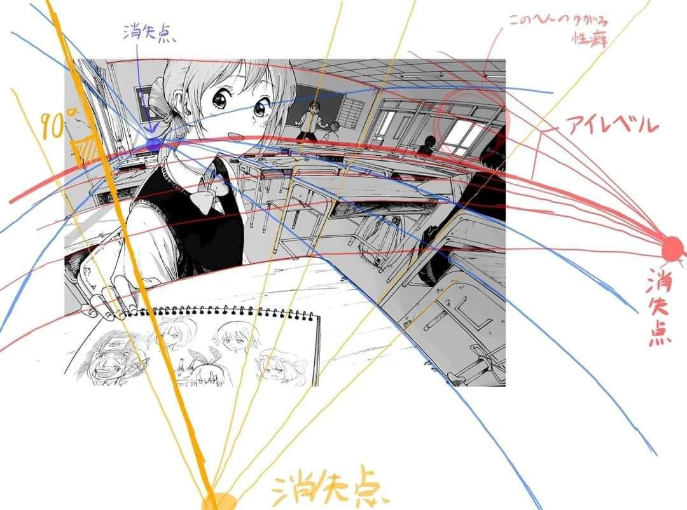

# Interactive 3D Perspective Projection Visualization

An interactive web application that demonstrates the principles of perspective projection by visualizing how a 3D cube projects onto different 2D surfaces. This educational tool compares **linear perspective** (planar projection) with **hemispherical perspective** (spherical projection).


## Live Demo

**[Try it now!](https://yiihuang.github.io/perspective_projection/index.html)** - No installation required! 

## Future Direction

The next phase of this project aims to leverage machine learning to develop an intelligent model capable of analyzing real-world images and automatically determining their perspective characteristics. This ambitious goal involves:

### Core Objectives
- **Perspective Analysis**: Automatically identify the type of perspective projection used in input images
- **3D Structure Understanding**: Determine object distances and orientations relative to the camera
- **Reference Plane Detection**: Identify and utilize reference planes (such as the earth plane) for spatial reasoning
- **World Model Integration**: Contribute to building next-generation AI systems that understand real-world 3D structure

### Example Workflow
The envisioned system would work as follows:

1. **Input**: A real-world photograph 

2. **Analysis**: ML model processes the image to extract perspective information
3. **Output**: Detailed 3D spatial understanding 

*Example images courtesy of [Omao's X post](https://x.com/omao_51061954/status/1215486113785081857)*

### Applications
This technology could significantly enhance:
- **Video Generation**: Improved consistency in 3D-aware content creation
- **Computer Vision**: Better understanding of spatial relationships in images
- **Autonomous Systems**: Enhanced perception and navigation capabilities
- **Augmented Reality**: More accurate virtual object placement in real environments

## Functionality

This application provides real-time visualization of:

- **3D Cube Manipulation**: Interactive rotation and positioning of a 3D cube
- **Dual Projection Views**: Side-by-side comparison of linear and hemispherical projections
- **Vanishing Point Visualization**: Guide lines showing how parallel edges converge
- **Real-time Updates**: All changes instantly reflected across all views
- **Interactive Controls**: Adjustable viewpoint, radius, and cube orientation

## Projection Methods

### Linear Perspective
- **Planar Projection**: Traditional perspective onto a flat image plane
- **Straight Lines**: 3D edges project as straight lines in 2D
- **Vanishing Points**: Convergence points for parallel lines
- **Fixed Reference Frame**: Viewpoint-centered coordinate system

### Hemispherical Perspective  
- **Spherical Projection**: Projection onto a hemispherical surface
- **Postel Projection**: Mathematical mapping from hemisphere to 2D plane
- **Circular Arcs**: 3D straight lines become circular arcs in 2D
- **Guide Lines**: Visual connections showing arc extensions to vanishing points
- **Boundary Handling**: Special cases for vanishing points on the boundary circle

## Quick Start

```bash
# Clone the repository
git clone https://github.com/yiihuang/perspective_projection.git
cd perspective_projection

# Start local server (required for ES6 modules)
python3 -m http.server 8000

# Open in browser
http://localhost:8000
```